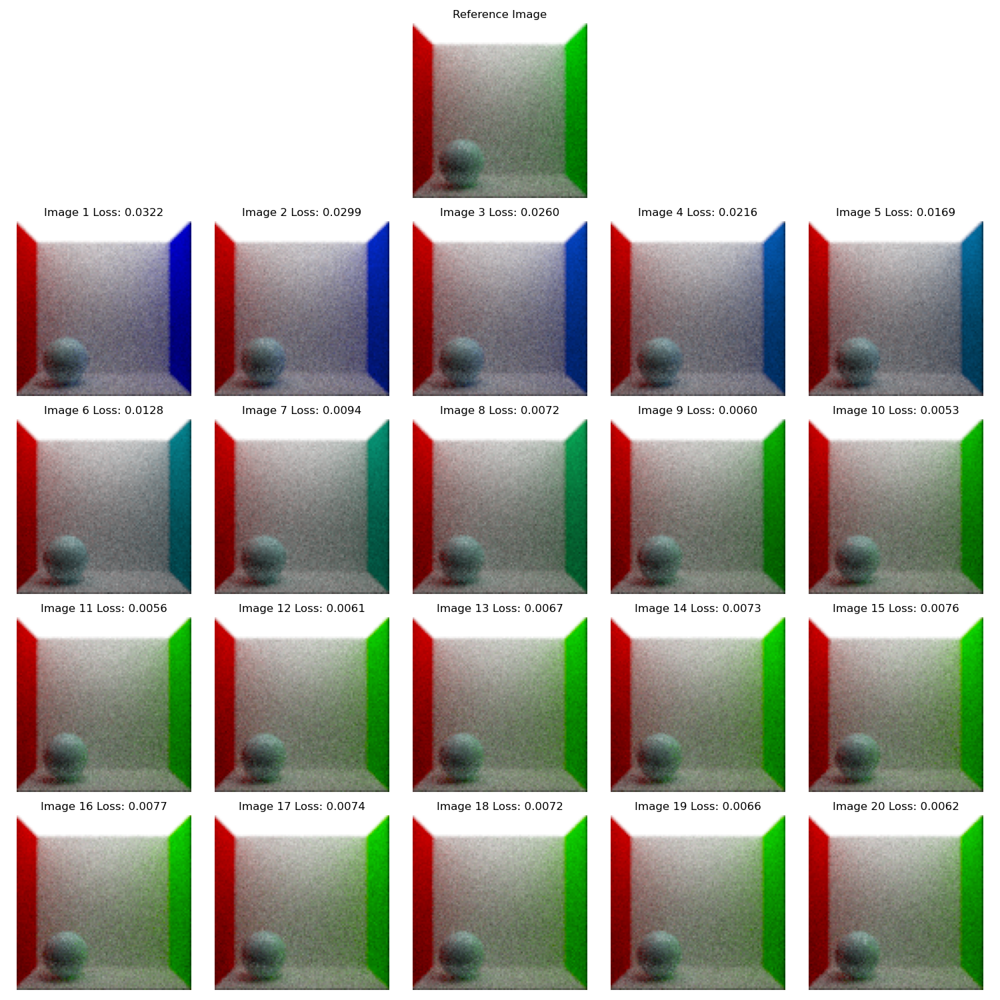
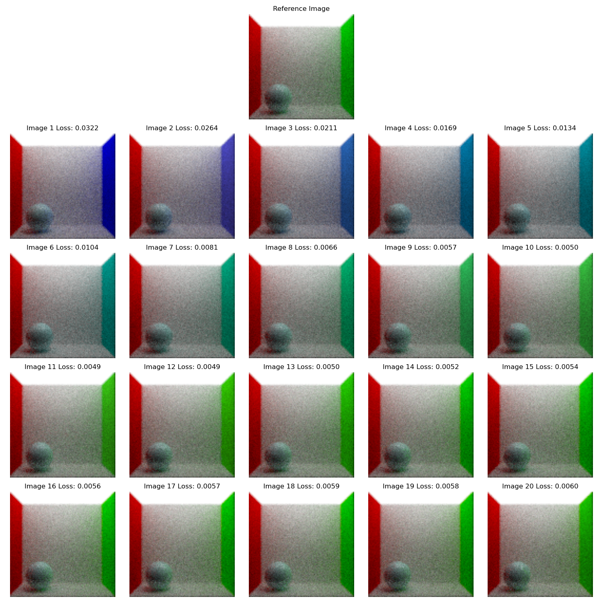

# DiffRT

Proof of concept differentiable ray(path) tracer.

Actually, it's just a little (and not very efficient) (reverse-mode) autodiff engine (`src/autograd.h`) with a ray tracer on top of it. There is nothing special about the ray tracer.

## Example

I tried making it as similar to PyTorch as possible since I have a little experience with it. And i like the API.

Basically what the `src/main.cc` does is:

```c++
// Create target image
render(scene, target, ...);

// As a axample I'll change the color of the right wall to blue
scene.objects[8]->material->diffuseBSDF->k.x.update(0.0);
scene.objects[8]->material->diffuseBSDF->k.y.update(0.0);
scene.objects[8]->material->diffuseBSDF->k.z.update(0.9);

// Set learnable parameters
scene.objects[8]->material->diffuseBSDF->k.requires_grad(true);

// Define optimizer
SGD optimizer(lr);
// Add parameters to optimizer
optimizer.add_param(scene.objects[8]->material->diffuseBSDF->k);

// Loop over the optimization steps (very similar to PyTorch)
for (int i = 0; i < n; i++) {
    // Reset gradients
    optimizer.zero_grad();

    // Render the image
    render(scene, pred, ...);

    // Compute loss
    auto loss = MSE(target, pred, ...);

    // Compute gradients
    loss.backward();

    // Update parameters
    optimizer.step();
}
```

## Results

|      SGD      |      ADAM      | 
|:-------------:|:--------------:|
|||

## Build
```bash
make -j
```